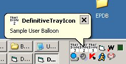



## Definitive Tray Icon v\. 0\.3

### Description

DEFINITIVE TRAY ICON v. 0.3

By: Phil Ciebiera

----

If you like it give me a vote,

The goal of this is to demonstrate a more effective usage of the System Tray Icon in VB.

Using my method gives you these features:

-Explorer.exe crash detection (tray icon persists)

-Native Windows Balloon Tips (with 5 icon styles or no icon)

-Low level detection of window messages

-Ability to use multiple tray icons for 1 form (now demonstrated)

-Have a user defined icon in a balloon tip

-You can detect when a user clicks your balloon

-You can make a balloon popup with or without sound

Learn from it and enjoy.

Thanks to Mark Mokoski for explaining the right way to use balloon tips from VB,

see his code on PSC.

Thanks to LaVolpe for pointing out several issues. (:

Hopefully a class will come soon (;

-Phil
 
### More Info
 

             |
---                |---
**Submitted On**   |2006-04-21 23:29:12
**By**             |[Philip Ciebiera](https://github.com/Planet-Source-Code/PSCIndex/blob/master/ByAuthor/philip-ciebiera.md)
**Level**          |Advanced
**User Rating**    |5.0 (45 globes from 9 users)
**Compatibility**  |VB 6\.0
**Category**       |[Coding Standards](https://github.com/Planet-Source-Code/PSCIndex/blob/master/ByCategory/coding-standards__1-43.md)
**World**          |[Visual Basic](https://github.com/Planet-Source-Code/PSCIndex/blob/master/ByWorld/visual-basic.md)
**Archive File**   |[Definitive1988914212006\.zip](https://github.com/Planet-Source-Code/philip-ciebiera-definitive-tray-icon-v-0-3__1-65067/archive/master.zip)

